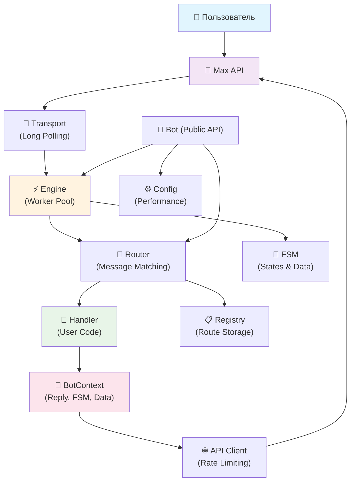

# Go Max SDK

Высокопроизводительный SDK для разработки ботов Max API на Go с декларативным подходом к маршрутизации и zero-allocation архитектурой.

## 🚀 Особенности

- **Декларативный API** - Простой и понятный синтаксис
- **Высокая производительность** - 29ns на обработку сообщения  
- **Zero allocations** - Оптимизированные hot paths
- **FSM поддержка** - Конечные автоматы для сложных диалогов
- **Middleware система** - Гибкая обработка запросов
- **Graceful shutdown** - Корректное завершение работы
- **Rate limiting** - Встроенная защита от превышения лимитов
- **Структурированное логирование** - Детальное отслеживание работы

## 📦 Установка

```bash
go get github.com/AlexMayka/go-max-sdk
```

## 🏁 Быстрый старт

```go
package main

import (
    maxsdk "github.com/AlexMayka/go-max-sdk"
)

func main() {
    bot := maxsdk.NewBot("your-bot-token")
    
    bot.OnCommand("/start", func(ctx *maxsdk.BotContext) {
        ctx.Reply("Привет! Я бот на Go Max SDK 🤖")
    })
    
    bot.Any(func(ctx *maxsdk.BotContext) {
        if ctx.Text != "" {
            ctx.Reply("Вы написали: " + ctx.Text)
        }
    })
    
    bot.Start()
}
```

➡️ **Следующие шаги:**
1. 📖 Изучите [документацию](docs/) для понимания всех возможностей
2. 💡 Посмотрите [примеры](examples/) от простого к сложному
3. ⚙️ Настройте [конфигурацию](docs/config.md) под вашу нагрузку

## 📚 Документация

Детальная документация доступна в папке [`docs/`](docs/):

| Документ | Описание |
|----------|----------|
| **[Обработчики](docs/handlers.md)** | Все типы обработчиков и роутинг |
| **[Контекст](docs/context.md)** | BotContext API и FSM состояния |
| **[Конфигурация](docs/config.md)** | Настройка производительности |
| **[Навигация](docs/README.md)** | Быстрый поиск по документации |

## 📚 Примеры

В директории [`examples/`](examples/) представлены детальные примеры использования:

| Пример | Описание |
|--------|----------|
| [echo_bot](examples/echo_bot/) | Базовые команды и эхо-ответы |
| [router_bot](examples/router_bot/) | Система маршрутизации и группировка |
| [fsm_bot](examples/fsm_bot/) | Конечные автоматы и состояния |
| [context_bot](examples/context_bot/) | Работа с контекстом и данными |
| [config_bot](examples/config_bot/) | Конфигурация и настройки |
| [logger_bot](examples/logger_bot/) | Система логирования |
| [advanced_bot](examples/advanced_bot/) | Продвинутые возможности |
| [stop_bot](examples/stop_bot/) | Graceful shutdown |

## 🏗️ Архитектура

SDK построен по принципам Clean Architecture с высокопроизводительной обработкой сообщений:



### 📁 Структура проекта

```
go-max-sdk/
├── bot.go              # 🤖 Публичный API
├── docs/               # 📚 Детальная документация
├── internal/           # 🔒 Внутренняя логика
│   ├── core/          # 🎯 Интерфейсы и типы
│   ├── api/           # 🌐 HTTP клиент с rate limiting
│   ├── engine/        # ⚡ Worker pool для обработки
│   ├── transport/     # 🚀 Long polling транспорт
│   ├── router/        # 🔀 Система маршрутизации
│   ├── fsm/           # 🔄 Конечные автоматы
│   └── registry/      # 📋 Регистрация обработчиков
├── types/             # 📄 Модели Max API
└── examples/          # 💡 Примеры использования
```

### 🔄 Поток обработки сообщений

1. **Transport** получает updates через long polling
2. **Engine** распределяет сообщения по worker pool
3. **Router** находит подходящий обработчик по правилам
4. **Handler** выполняется с **BotContext**
5. **BotContext** предоставляет доступ к FSM, API, данным
6. **API Client** отправляет ответы с rate limiting

## ⚡ Производительность

```
BenchmarkMessageDispatch-8    43,478,261    29.0 ns/op    0 B/op    0 allocs/op
```

🚀 **Ключевые метрики:**
- **29 наносекунд** - время диспетчеризации сообщения
- **0 аллокаций** - в горячих путях обработки
- **43М ops/sec** - пропускная способность
- **Lock-free** - token bucket rate limiting
- **Worker pool** - параллельная обработка сообщений

## 🛠️ Основные возможности

### Маршрутизация

```go
bot.OnCommand("/start", startHandler)
bot.OnMessage("hello", messageHandler)  
bot.OnRegex(`^/calc (\d+)$`, calcHandler)
bot.Any(fallbackHandler)
```

### Middleware

```go
router := maxsdk.DefaultRouter()
router.Use(loggingMiddleware, authMiddleware)

adminGroup := router.Group("/admin").Use(adminMiddleware)
```

### FSM состояния

```go
bot.OnCommand("/register", func(ctx *maxsdk.BotContext) {
    ctx.Reply("Введите имя:")
    ctx.SetState("waiting_name")
})

bot.UseState("waiting_name").Any(func(ctx *maxsdk.BotContext) {
    ctx.SetData("name", ctx.Text)
    ctx.Reply("Введите email:")
    ctx.SetState("waiting_email")
})
```

### Конфигурация

```go
bot.Config.MaxWorkers = 10
bot.Config.APIRateLimit = 20.0
bot.Config.RequestTimeout = 30 * time.Second
```

## 🔧 Конфигурация

| Параметр | По умолчанию | Описание |
|----------|--------------|----------|
| `MaxWorkers` | 20 | Количество воркеров |
| `WorkerQueueSize` | 100 | Размер очереди |
| `APIRateLimit` | 20.0 | Лимит запросов/сек |
| `RequestTimeout` | 30s | Тайм-аут запросов |
| `ShutdownTimeout` | 10s | Тайм-аут завершения |

## 🚦 Graceful Shutdown

```go
bot.OnCommand("/stop", func(ctx *maxsdk.BotContext) {
    ctx.Reply("Завершение работы...")
    go func() {
        time.Sleep(100 * time.Millisecond)
        bot.Stop()
    }()
})
```

## 📊 Логирование

```go
bot.Logging = true  // Включить встроенное логирование

// Или кастомный логгер
bot.Logger = &CustomLogger{}
```

## 🆚 Сравнение с официальным SDK

| Критерий | Go Max SDK | Официальный SDK |
|----------|------------|-----------------|
| **Подход** | Декларативный | Императивный |
| **API** | `bot.OnCommand("/start", handler)` | Ручная обработка событий |
| **Производительность** | 29ns, 0 allocs | Стандартная |
| **FSM** | Встроенная поддержка | Требует реализации |
| **Middleware** | Есть | Нет |
| **Rate Limiting** | Автоматический | Ручная реализация |

## 🤝 Вклад в проект

1. Fork репозиторий
2. Создайте feature branch
3. Напишите тесты
4. Создайте pull request

## 📄 Лицензия

MIT License - подробности в файле [LICENSE](LICENSE)

## 🔗 Ссылки

- [Max API Documentation](https://dev.max.ru/docs-api)
- [Официальный Go SDK](https://github.com/max-messenger/max-bot-api-client-ts)
- [Примеры использования](examples/)

---

**Сделано с ❤️ для разработчиков ботов**