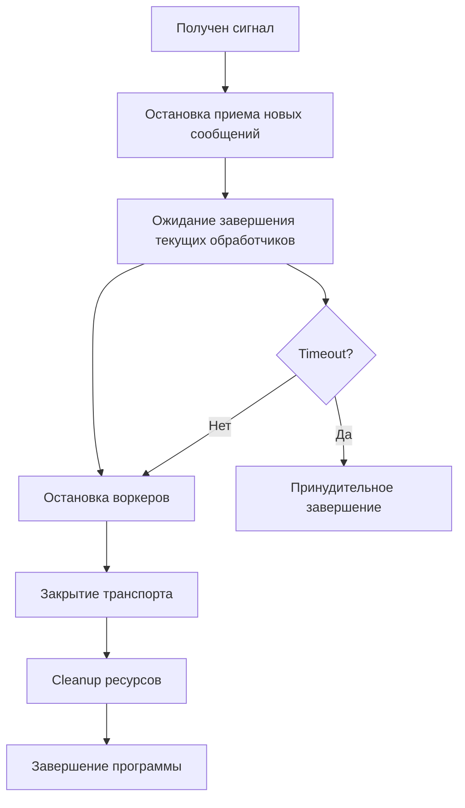

# Stop Bot

## Описание

Демонстрирует graceful shutdown бота - корректное завершение работы с сохранением целостности данных и завершением обработки текущих сообщений. Показывает работу с системными сигналами и управление жизненным циклом приложения.

## Функциональность

- 🛑 **Graceful shutdown** по команде `/stop`
- 📡 **Signal handling** (Ctrl+C, SIGTERM)
- ⏱️ **Timeout control** для предотвращения зависания
- 🔄 **Background tasks** с корректным завершением
- 📊 **Monitoring** состояния бота
- ⚙️ **Настраиваемые тайм-ауты**

## Команды

| Команда | Описание |
|---------|----------|
| `/start` | Запуск бота с информацией |
| `/ping` | Проверка работоспособности |
| `/stop` | Graceful shutdown бота |
| `Ctrl+C` | Системный сигнал для остановки |

## Механизмы остановки

### 1. Команда `/stop`
```go
bot.OnCommand("/stop", func(ctx *maxsdk.BotContext) {
    ctx.Reply("🛑 Bot is shutting down gracefully...")
    
    go func() {
        time.Sleep(100 * time.Millisecond)  // Дать время отправить ответ
        bot.Stop()
    }()
})
```

### 2. Signal handling (Ctrl+C)
```go
sigChan := make(chan os.Signal, 1)
signal.Notify(sigChan, syscall.SIGINT, syscall.SIGTERM)

sig := <-sigChan
log.Printf("Received signal %v, shutting down...", sig)
```

### 3. Timeout protection
```go
ctx, cancel := context.WithTimeout(context.Background(), 10*time.Second)
defer cancel()

select {
case err := <-done:
    log.Println("Bot stopped gracefully")
case <-ctx.Done():
    log.Println("Shutdown timeout exceeded, forcing exit")
}
```

## Конфигурация shutdown

### Тайм-аут завершения
```go
bot.Config.ShutdownTimeout = 15*time.Second  // Время на graceful shutdown
```

### Что происходит при shutdown:

1. **Остановка приема новых сообщений**
2. **Завершение обработки текущих сообщений**
3. **Остановка воркеров**
4. **Закрытие транспорта (long polling)**
5. **Cleanup ресурсов**

## Background tasks

### Мониторинг состояния
```go
go func() {
    ticker := time.NewTicker(30 * time.Second)
    defer ticker.Stop()
    
    for {
        select {
        case <-ticker.C:
            log.Println("Background task: Bot is alive")
        }
    }
}()
```

### Правильное завершение background задач
```go
type Bot struct {
    shutdown chan struct{}
}

go func() {
    ticker := time.NewTicker(30 * time.Second)
    defer ticker.Stop()
    
    for {
        select {
        case <-ticker.C:
            // Выполнить задачу
        case <-bot.shutdown:
            log.Println("Background task stopped")
            return  // Завершить goroutine
        }
    }
}()
```

## Этапы graceful shutdown



## Отладка и логирование

### Процесс остановки
```go
log.Printf("Received signal %v, shutting down...", sig)
log.Println("Bot stopped gracefully")
log.Println("Shutdown timeout exceeded, forcing exit")
```

### Состояние компонентов
```go
log.Println("Stopping transport...")
log.Println("Stopping workers...")
log.Println("Cleanup completed")
```

## Production considerations

### Systemd integration
```ini
[Unit]
Description=Max Bot
After=network.target

[Service]
Type=simple
ExecStart=/path/to/bot
Restart=always
RestartSec=5
TimeoutStopSec=30

[Install]
WantedBy=multi-user.target
```

### Docker graceful shutdown
```dockerfile
FROM golang:alpine AS builder
COPY . .
RUN go build -o bot .

FROM alpine
RUN apk add --no-cache ca-certificates
COPY --from=builder /app/bot /bot
CMD ["/bot"]
```

```yaml
# docker-compose.yml
services:
  bot:
    build: .
    restart: unless-stopped
    stop_grace_period: 30s  # Время на graceful shutdown
```

### Kubernetes deployment
```yaml
apiVersion: apps/v1
kind: Deployment
metadata:
  name: max-bot
spec:
  template:
    spec:
      terminationGracePeriodSeconds: 30
      containers:
      - name: bot
        image: max-bot:latest
        lifecycle:
          preStop:
            exec:
              command: ["/bin/sh", "-c", "sleep 5"]  # Дать время на cleanup
```

## Тестирование graceful shutdown

### 1. Запуск бота
```bash
go run main.go
```

### 2. Проверка работы
```
/start  → "Stop Bot started! 🟢"
/ping   → "🏓 Pong! Bot is running..."
```

### 3. Graceful shutdown через команду
```
/stop   → "🛑 Bot is shutting down gracefully..."
        → Бот корректно завершается
```

### 4. Системный сигнал
```bash
# В терминале нажать Ctrl+C
^C
2024/01/15 10:30:00 Received signal interrupt, shutting down...
2024/01/15 10:30:01 Bot stopped gracefully
```

### 5. Проверка логов
```
Starting Stop Bot... Press Ctrl+C to stop gracefully
Background task: Bot is alive
Background task: Bot is alive
^C
Received signal interrupt, shutting down...
Bot stopped gracefully
```

## Best Practices

### 1. Всегда используйте graceful shutdown
```go
// ❌ Плохо
os.Exit(1)

// ✅ Хорошо  
bot.Stop()
```

### 2. Настраивайте тайм-ауты
```go
bot.Config.ShutdownTimeout = 30*time.Second  // Production
bot.Config.ShutdownTimeout = 5*time.Second   // Development
```

### 3. Логируйте процесс остановки
```go
log.Println("Starting graceful shutdown...")
log.Println("All workers stopped")
log.Println("Shutdown completed successfully")
```

### 4. Обрабатывайте ошибки
```go
if err := bot.Stop(); err != nil {
    log.Printf("Error during shutdown: %v", err)
    os.Exit(1)
}
```

### 5. Тестируйте shutdown в CI/CD
```go
func TestGracefulShutdown(t *testing.T) {
    bot := maxsdk.NewBot("test-token")
    
    go func() {
        time.Sleep(100 * time.Millisecond)
        bot.Stop()
    }()
    
    err := bot.Start()  // Должен завершиться без ошибки
    assert.NoError(t, err)
}
```

## Следующие шаги

После изучения всех примеров вы готовы к созданию production-ready ботов:

1. **Начните с** [echo_bot](../echo_bot/) для базового понимания
2. **Изучите** [fsm_bot](../fsm_bot/) для сложных диалогов  
3. **Примените** [advanced_bot](../advanced_bot/) паттерны в своем проекте
4. **Реализуйте** graceful shutdown из этого примера

**Удачи в разработке ботов на Max Bot SDK!** 🚀